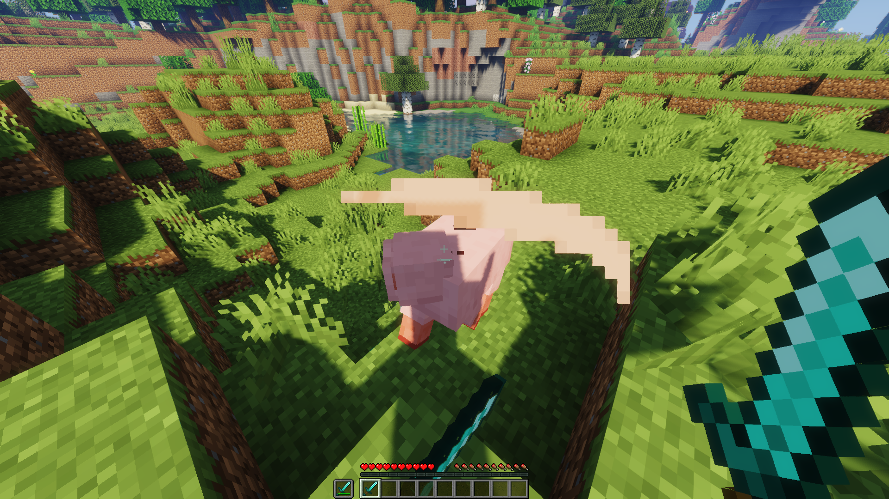
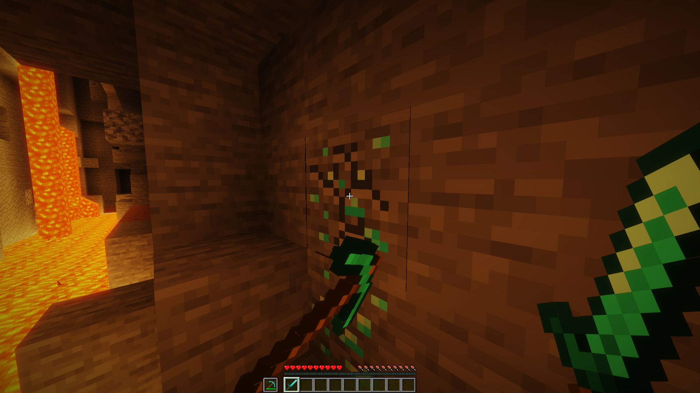

A lightweight and unintrusive plugin to add vanilla friendly attacking and mining with off-hand weapons and tools.​

# Supports:

* 1.9.\*, 1.10\.*, 1.11\.*, 1.12\.*, 1.13\.*, 1.14\.*, 1.15\.*, 1.16\.*, 1.17\.*, 1.18\.*, 1.19\.*, 1.20\.*
* Spigot, Paper, Purpur, Pufferfish, Airplane, Tuinity, CraftBukkit, Mohist, Magma, CatServer, MultiPaper
* GeyserMC (Bedrock Players)
* Forge/Bukkit Hybrid servers (Mohist, Magma, CatServer)


# Compatibility:
This plugin should be compatible with all protection plugins, plugins that prevent damage events and block break events. It is also compatible with all third party enchantment and skill plugins like McMMO.


# Geyser:
Attacking works but without an animation for Bedrock clients.
See GitHub issues:
Geyser/issues/3480
GeyserOptionalPack/issues/40


# Event API:
* [OffHandAttackEvent](https://github.com/AvarionMC/dualwield/blob/master/core/src/main/java/org/avarion/dualwield/event/OffHandAttackEvent.java)
* [OffHandBlockBreakEvent](https://github.com/AvarionMC/dualwield/blob/master/core/src/main/java/org/avarion/dualwield/event/OffHandBlockBreakEvent.java)


# `pom.xml` inclusions for Maven
## Repository
```xml
<repository>
    <id>dualwield</id>
    <url>https://maven.pkg.github.com/AvarionMC/dualwield/</url>
</repository>
```
## Dependency
```xml
<dependency>
    <groupId>com.ranull</groupId>
    <artifactId>dualwield</artifactId>
    <version>[..latest version..]</version>
    <scope>provided</scope>
</dependency>
```


# Permissions:
* dualwield.attack (Default)
* dualwield.mine (Default)
* dualwield.reload (OP)


# Video:
[](https://www.youtube.com/watch?v=2d7zeuqgrew)

**Video by:** _OG Vampire_


# Screenshots:
## Attacking with the off-hand


## Mining with the off-hand



# Usage

